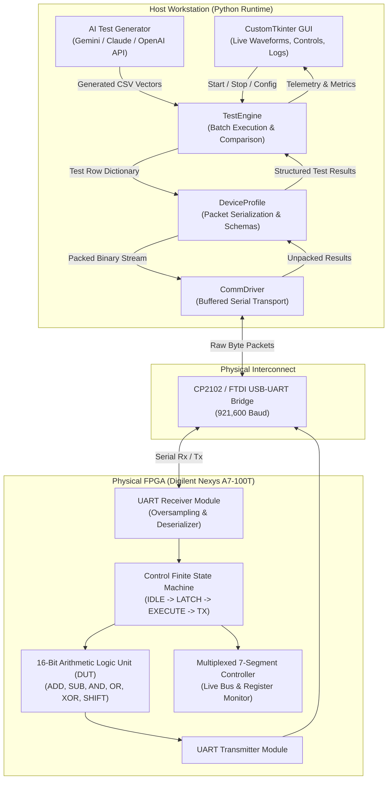

# VAIDAR: Verification & Artificial Intelligence for Digital Architecture Runtime

[-success?style=for-the-badge&logo=academic-tree)](https://www.harry-rogers.com)
[](https://www.harry-rogers.com)
[-orange?style=for-the-badge&logo=xilinx)](https://digilent.com/reference/programmable-logic/nexys-a7/start)
[](https://github.com/HarryRogers073/vaidar)

> **VAIDAR** is an automated Hardware-in-the-Loop (HIL) verification testbench developed as my Final Year BEng dissertation project at the **University of Brighton**. It connects Python test automation directly to physical FPGA silicon over a high-speed (921,600 baud) UART link. It streams test vectors into physical registers, validates outputs against a software golden model at ~1,000 tests per second, and provides an optional LLM interface (Gemini, Claude, GPT) for edge-case test generation and failure diagnosis.

---

### Academic Integrity & Attribution Disclosure
- **Author:** Developed and authored by **Harry Rogers** as an individual BEng dissertation project under academic supervision at the University of Brighton.
- **Award:** Recognised with **The IET Prize 2026** by the Institution of Engineering and Technology (Final Dissertation Grade: 91% / A+).
- **Custom Hardware & Firmware:** All custom Verilog RTL modules (16-bit ALU, control FSM, seven-segment display controller) and all Python software (GUI, execution engine, golden model, device profiles) were written by Harry Rogers.
- **Adapted Hardware:** The UART receiver core (`hardware/src/sources_1/new/uart_receiver.v`) was adapted from Russell Merrick's open-source Nandland UART module with custom oversampling and framing for this platform.
- **Third-Party Libraries:** Standard open-source libraries used include `pyserial` (serial communication), `customtkinter` (desktop GUI), `matplotlib` (waveform plotting), and official API SDKs from Google, Anthropic, and OpenAI.

---

## Key Performance & Features

- **91% Final Distinction Grade (A+)** in Capstone Individual Dissertation Project.
- **Recipient of the IET Prize 2026** awarded by the Institution of Engineering and Technology.
- **~1,000 Tests/Second Throughput:** Streams test vectors over a 921,600 baud serial connection, validating physical silicon outputs orders of magnitude faster than manual bench probing.
- **Deterministic Golden Model:** Software simulation in Python computes expected NZCV flags and arithmetic outputs for cycle-accurate assertion checks.
- **AI-Assisted Test Generation:** Integrated LLM interfaces for automated boundary test generation and root-cause clustering of failure logs.
- **Modular Hardware Interfaces:** Easily switch between physical UART, TCP/IP, or offline software Mock simulation mode.

---

## System Architecture

The verification framework operates as a closed-loop transaction pipeline between the host workstation and the physical FPGA testbed:



---

## Software Structure

VAIDAR organizes verification into clear, decoupled layers:

1. **`TestEngine` (`core/engine.py`):** Coordinates batch test queues, monitors transaction timeouts, compares physical FPGA response bytes against the software golden model, and records detailed pass/fail logs.
2. **`DeviceProfile` (`core/interfaces.py`):** Converts human-readable test vector dictionaries into packed binary frames (`pack_command`) and deserializes raw hardware byte responses into typed fields (`unpack_response`).
3. **`CommDriver` (`core/interfaces.py`):** Manages serial communication (`uart_driver.py`) or loopback simulation (`mock_driver.py`) with automatic connection recovery.

---

## Hardware Implementation (Verilog HDL)

Targeted to the **AMD Xilinx Artix-7 (`XC7A100T-1CSG324C`)** on the Digilent Nexys A7 development board:

- **`top_16bit_alu.v`:** Top-level hardware module integrating the arithmetic core, internal registers, and control FSM.
- **`uart_receiver.v`:** Serial UART receiver with 16x oversampling and framing error detection (adapted from Nandland).
- **`seven_segment_controller.v`:** Multiplexed 7-segment display driver for live visual inspection of accumulator registers and status flags.
- **`nexys_a7_alu.xdc`:** Timing constraints (100 MHz oscillator) and pin allocations for onboard peripherals and USB-UART bridge.

---

## → Quick Start

### 1. Installation
Clone the repository and install dependencies:
```bash
git clone https://github.com/HarryRogers073/vaidar.git
cd vaidar
pip install -r requirements.txt
```

### 2. Configure Environment (Optional for AI features)
Copy the example environment configuration:
```bash
cp .env.example .env
```
Add your API keys (`GEMINI_API_KEY`, `ANTHROPIC_API_KEY`, or `OPENAI_API_KEY`) if you want to use automated test generation.

### 3. Launch the GUI
Run the application launcher:
```bash
python app.py
```
*(On Windows, you can also double-click `run.bat`)*

### 4. Running in Mock Mode (No Hardware Required)
If you don't have a physical FPGA board connected:
1. Open the application.
2. In the **Connection Settings**, select `Mock (Simulation)` as the Driver.
3. Select `16-bit ALU` as the Device Profile.
4. Click **Start Verification** to observe live vector execution, waveforms, and pass/fail telemetry.

---

## Repository Structure

```text
vaidar/
├── app.py                      # Application entry point
├── config.json                 # Persistent configuration settings
├── requirements.txt            # Python dependencies
├── .env.example                # Template for AI provider API keys
├── ai/                         # LLM integration modules
│   ├── gemini_provider.py      # Google Gemini API vector generator
│   ├── claude_provider.py      # Anthropic Claude API provider
│   ├── chatgpt_provider.py     # OpenAI GPT API provider
│   └── mock_provider.py        # Offline simulated AI engine
├── core/                       # Core execution runtime
│   ├── engine.py               # TestEngine runner
│   ├── interfaces.py           # Abstract base classes (DeviceProfile, CommDriver)
│   ├── generate_tests.py       # Algorithmic test vector generation & golden model
│   └── config_manager.py       # Configuration parser
├── drivers/                    # Transport layers
│   ├── uart_driver.py          # PySerial hardware COM port driver
│   └── mock_driver.py          # In-memory loopback simulation driver
├── profiles/                   # Target device schemas
│   ├── alu_16bit.py            # 16-bit ALU profile (Nexys A7)
│   ├── alu_8bit.py             # 8-bit coprocessor profile
│   └── encoder_3to5.py         # Priority encoder profile
├── gui/                        # CustomTkinter graphical dashboard
│   ├── app_shell.py            # Main application window & tabs
│   ├── live_graph.py           # Waveform oscilloscope visualization
│   ├── ai_console.py           # Interactive AI assistant console
│   └── results_table.py        # Live test telemetry and metrics table
├── hardware/                   # Vivado FPGA project & Verilog HDL sources
│   ├── ALU.xpr                 # Vivado project file
│   └── src/                    # Verilog sources & XDC constraints
│       ├── sources_1/new/top_16bit_alu.v
│       ├── sources_1/new/uart_receiver.v
│       ├── sources_1/new/seven_segment_controller.v
│       └── constrs_1/new/nexys_a7_alu.xdc
├── test_queue/                 # Sample test vectors (CSV format)
└── docs/                       # Architectural diagrams & schematics
```

---

## Academic Attribution & Author

- **Author:** Harry Rogers
- **Degree:** BEng (Hons) Electronic & Computer Engineering (First-Class Honours, 80% Overall)
- **Institution:** University of Brighton
- **Project:** Capstone BEng Individual Dissertation Project (Grade: 91% / A+)
- **Distinction:** Recipient of **The IET Prize 2026**
- **Website:** [www.harry-rogers.com](https://www.harry-rogers.com)
- **LinkedIn:** [linkedin.com/in/harryrogers073](https://www.linkedin.com/in/harryrogers073/)

---

## License
This project is licensed under the MIT License - see the [LICENSE](LICENSE) file for details.
