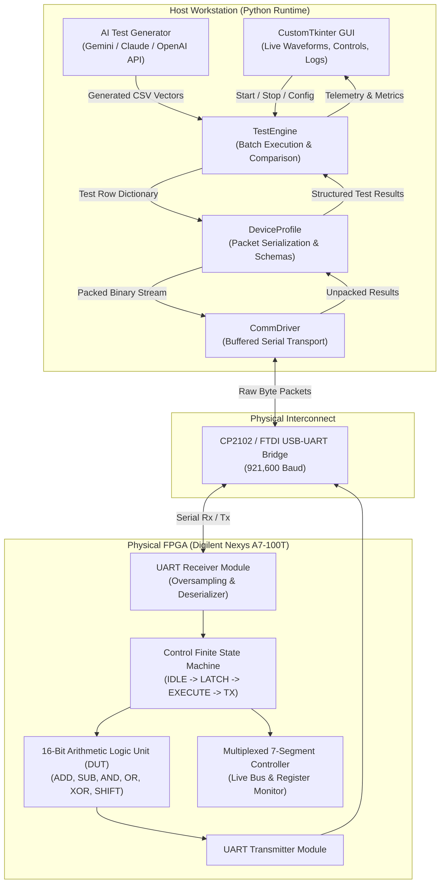

# VAIDAR: Verification & Artificial Intelligence for Digital Architecture Runtime

[-success?style=for-the-badge&logo=academic-tree)](https://www.harry-rogers.com)
[](https://www.harry-rogers.com)
[-orange?style=for-the-badge&logo=xilinx)](https://digilent.com/reference/programmable-logic/nexys-a7/start)
[](https://github.com/HarryRogers073/vaidar)

> **VAIDAR** is an automated Hardware-in-the-Loop (HIL) verification testbench developed as my Final Year BEng dissertation project at the **University of Brighton**. It connects Python test automation directly to physical FPGA silicon over a high-speed (921,600 baud) UART link. It streams test vectors into physical registers, validates outputs against a software golden model at ~1,000 tests per second, and provides an optional LLM interface (Gemini, Claude, GPT) for edge-case test generation and failure diagnosis.

---

### Academic Integrity & Attribution Disclosure
- **Author:** Developed and authored by **Harry Rogers** as an individual BEng dissertation project under academic supervision at the University of Brighton.
- **Award:** Recognised with **The IET Prize 2026** by the Institution of Engineering and Technology (Final Dissertation Grade: First Class 91% / A+).
- **Custom Hardware & Firmware:** All custom Verilog RTL modules (16-bit ALU, control FSM, seven-segment display controller) and all Python software (GUI, execution engine, golden model, device profiles) were written by Harry Rogers.
- **Adapted Hardware:** The UART receiver core (`hardware/src/sources_1/new/uart_receiver.v`) was adapted from Russell Merrick's open-source Nandland UART module with custom oversampling and framing for this platform.
- **Third-Party Libraries:** Standard open-source libraries used include `pyserial` (serial communication), `customtkinter` (desktop GUI), `matplotlib` (waveform plotting), and official API SDKs from Google, Anthropic, and OpenAI.

---

## Key Performance & Features

- **First Class 91% (A+)** in Capstone Individual Dissertation Project.
- **Recipient of the IET Prize 2026** awarded by the Institution of Engineering and Technology.
- **~1,000 Tests/Second Throughput:** Streams test vectors over a 921,600 baud serial connection, validating physical silicon outputs orders of magnitude faster than manual bench probing.
- **Deterministic Golden Model:** Software simulation in Python computes expected NZCV flags and arithmetic outputs for cycle-accurate assertion checks.
- **AI-Assisted Test Generation:** Integrated LLM interfaces for automated boundary test generation and root-cause clustering of failure logs.
- **Modular Hardware Interfaces:** Easily switch between physical UART, TCP/IP, or offline software Mock simulation mode (no hardware required to evaluate).
- **Pre-Built Bitstreams Included:** Program the physical FPGA board immediately without needing a 50GB Xilinx Vivado installation.

---

## System Architecture

The verification framework operates as a closed-loop transaction pipeline between the host workstation and the physical FPGA testbed:



---

## 🔌 Complete Hardware Setup & Physical Testbed Guide

Anyone with a Digilent Nexys A7 development board can replicate this setup in under 5 minutes.

### 1. Hardware Requirements
| Item | Specification | Notes |
| :--- | :--- | :--- |
| **FPGA Board** | **Digilent Nexys A7-100T** (or Nexys 4 DDR) | AMD Xilinx Artix-7 `XC7A100T-1CSG324C` |
| **Interface Cable** | Micro-USB to USB-A (or USB-C) | High-speed data cable (not power-only) |
| **Host PC** | Windows 10/11, Linux, or macOS | Python 3.10+ installed |
| **Optional Boot Drive** | FAT32 USB Thumb Drive | Required only for standalone USB boot |

---

### 2. Physical Jumper & Switch Settings

Before connecting the board, verify the following jumpers on the Nexys A7:

1. **Power Select Jumper (`JP3`)**: Set to **`USB`** (pins 1-2) to power the board from your PC's USB port. (If using an external 5V power supply, set to `WALL`).
2. **Programming Mode Jumper (`JP2` - labelled "MODE")**:
   - **For USB Flash Drive Boot (No Vivado Needed)**: Set to **`USB/SD`** (pins 2-3).
   - **For Vivado / JTAG Programming**: Set to **`JTAG`** (pins 1-2).
3. **Power Switch (`SW15`)**: Ensure the switch is initially in the **OFF** position.

---

### 3. Physical Connections
1. Connect the Micro-USB cable from your PC to the Nexys A7's **`PROG / UART` port (`J4`)** located directly adjacent to the power switch. *(Note: Do NOT connect to `USB HOST J8` for host communications — J4 handles both JTAG programming and high-speed UART serial).*
2. Flip power switch **`SW15`** to **ON**. The red power LED will illuminate.

---

### 4. Crucial Performance Tweak (Windows FTDI Latency Timer)

> [!IMPORTANT]
> **This step is critical to achieve ~1,000 tests/second.**
> By default, the Windows FTDI USB-Serial driver buffers small byte packets for **16 milliseconds** before flushing them to the operating system. Because VAIDAR operates on an interactive request-response transaction model, this 16 ms delay throttles test throughput down to ~60 tests/sec. Lowering the latency timer to **1 ms** unlocks the full 921,600 baud serial bandwidth.

**How to configure:**
1. Open **Windows Device Manager** (`Win + X` -> **Device Manager**).
2. Expand the **Ports (COM & LPT)** branch.
3. Locate **USB Serial Port (COMx)** corresponding to your Nexys A7.
4. Right-click the port and select **Properties**.
5. Go to the **Port Settings** tab and click **Advanced...**
6. Change the **Latency Timer (msec)** setting from `16` to **`1`**.
7. Click **OK**, then click **OK** again to apply.

```text
Device Manager -> Ports (COM & LPT) -> USB Serial Port (COMx)
  └── Properties -> Port Settings -> Advanced... -> Latency Timer (msec) = 1
```

---

### 5. Programming the Physical FPGA

Choose one of three methods:

#### Method A: Standalone USB Flash Drive Boot (Zero Vivado Installation Required)
1. Format a USB thumb drive to **FAT32**.
2. Copy the pre-built bitstream [`hardware/bitstreams/top_16bit_alu.bit`](hardware/bitstreams/top_16bit_alu.bit) to the **root** of the USB drive.
3. Insert the USB drive into the Nexys A7's **`USB HOST` port (`J8`)** (next to the RJ-45 Ethernet jack).
4. Set the **`JP2` (MODE)** jumper to **`USB/SD`**.
5. Switch **`SW15`** to **ON**.
6. The yellow **BUSY** LED will flash while configuring, followed by the bright green **DONE** LED turning solid. The FPGA is now fully programmed and listening!

#### Method B: Vivado Hardware Manager / Digilent Adept
1. Set the **`JP2` (MODE)** jumper to **`JTAG`**.
2. Open **Vivado Hardware Manager** (or Digilent Adept).
3. Click **Open Target** -> **Auto Connect**.
4. Select the `xc7a100t` target device and click **Program Device**.
5. Browse to [`hardware/bitstreams/top_16bit_alu.bit`](hardware/bitstreams/top_16bit_alu.bit) and flash.

#### Method C: Recompile from Source
1. Open [`hardware/ALU.xpr`](hardware/ALU.xpr) in AMD Xilinx Vivado (2022.2+ or 2024.x).
2. Click **Generate Bitstream** in the Flow Navigator to run synthesis, place & route, and bitstream generation.

---

### 6. On-Board Peripheral Map & Live Visual Auditing

While tests are executing, you can visually audit the physical hardware logic directly on the Nexys A7:

```text
  ┌─────────────────────────────────────────────────────────────┐
  │                 NEXYS A7-100T HARDWARE BUS                  │
  ├──────────────────────────────┬──────────────────────────────┤
  │ Seven-Segment Display        │ Status LEDs (NZCV Flags)     │
  │ [ DIGITS 7..4 ] [ DIGITS 3..0 ] │ [LD3] [LD2] [LD1] [LD0] [LD15]│
  │   Operand A /      16-bit    │   V     C     Z     N    Ready │
  │ Active Opcode      Result    │ Over  Carry Zero  Neg   Heart  │
  └──────────────────────────────┴──────────────────────────────┘
```

- **Eight-Digit Multiplexed Seven-Segment Display**:
  - **Digits 7..4 (Left):** Displays Operand A or the active ALU opcode mnemonic.
  - **Digits 3..0 (Right):** Displays the raw 16-bit ALU calculation result in hexadecimal.
- **Status LEDs (Condition Code Register)**:
  - **`LD0` — Negative Flag (N):** Illuminates when MSB (`Result[15]`) is `1` (negative signed value).
  - **`LD1` — Zero Flag (Z):** Illuminates when the computation result equals `0x0000`.
  - **`LD2` — Carry Flag (C):** Illuminates when an arithmetic carry out or borrow occurs.
  - **`LD3` — Overflow Flag (V):** Illuminates on signed two's-complement overflow or divide-by-zero.
  - **`LD15` — Ready Indicator:** Blinks to confirm active UART clock recovery and FSM idle sync.

---

## 💻 Software Installation & Step-by-Step Execution

### 1. Prerequisites
- **Python 3.10+** (tested on 3.10, 3.11, 3.12).
- Git.

### 2. Clone and Setup Environment
```bash
# Clone the repository
git clone https://github.com/HarryRogers073/vaidar.git
cd vaidar

# Create and activate a clean virtual environment
python -m venv venv

# Windows (Command Prompt / PowerShell):
venv\Scripts\activate

# Linux / macOS:
source venv/bin/activate

# Install required dependencies
pip install -r requirements.txt
```

---

### 3. Launching the GUI Dashboard

Run the main application:
```bash
python app.py
```
*(On Windows, you can simply double-click `run.bat`)*

---

### 4. Running Your First Test (Step-by-Step)

#### Workflow A: Physical Hardware Execution
1. In the **Connection Settings** top bar:
   - **Port:** Select your active FPGA COM port (e.g. `COM10` or `/dev/ttyUSB0`).
   - **Baud Rate:** Ensure `921600` is selected.
   - **Driver:** Choose `UART (Serial)`.
   - **Device Profile:** Choose `16-bit ALU`.
2. Click **Connect**. The status indicator will turn a solid green **Connected**.
3. Click the **Upload CSV Batch** button.
4. Navigate to [`sample_tests/02_Visual_Demonstration_Tests/`](sample_tests/02_Visual_Demonstration_Tests/) and select:
   `visual_demo_01_arithmetic_10s_delay.csv`
5. Click **Start Verification**.
6. **Watch the physical Nexys A7 board!** Because this demo suite is pre-configured with a 10-second delay per vector, the board will step through operations slowly, allowing you to physically audit the 7-segment display and NZCV LEDs against the live terminal log.

#### Workflow B: High-Throughput Silicon Benchmark (~1,000 tests/sec)
1. Open the **⚙ Settings** dialog in the GUI.
2. Set **Visual Delay (seconds)** to `0.0`.
3. Click **Upload CSV Batch** and choose [`sample_tests/03_Scale_Throughput_Benchmarks/benchmark_010000_tests.csv`](sample_tests/03_Scale_Throughput_Benchmarks/).
4. Click **Start Verification**.
5. Observe sustained streaming throughput (>950 tests/sec), dynamic oscilloscope waveform plots, and real-time pass/fail assertion checks.

#### Workflow C: Evaluating Without Hardware (Mock Mode)
If you do not have physical FPGA hardware connected:
1. Open the application.
2. In **Connection Settings**, set Driver to **`Mock (Simulation)`**.
3. Select any CSV test from `sample_tests/`.
4. Click **Start Verification**. The framework will simulate execution against the internal Python golden model with full functional equivalence.

---

### 5. Generating Custom Test Vectors

You can generate algorithmic test suites of any size using the built-in generator:

```bash
# Generate 1,000 random vectors:
python -m core.generate_tests 1000 my_tests.csv

# Generate 100,000 vectors for stress testing:
python -m core.generate_tests 100000 stress_100k.csv
```

---

### 6. AI-Assisted Test Generation & Anomaly Triage (Optional)

VAIDAR includes optional LLM integration (Google Gemini, Anthropic Claude, OpenAI ChatGPT) for intelligent boundary test synthesis:

1. Copy the template:
   ```bash
   cp .env.example .env
   ```
2. Open `.env` and paste your API key:
   ```ini
   GEMINI_API_KEY=your_key_here
   # or ANTHROPIC_API_KEY=your_key_here
   # or OPENAI_API_KEY=your_key_here
   ```
3. In the GUI, navigate to the **AI Assistant** tab.
4. Enter natural-language verification requests (e.g. *"Generate 20 edge-case vectors testing signed two's-complement overflow on 16-bit subtraction"*).
5. The model outputs syntactically valid CSV vectors directly into your test queue.

> [!NOTE]
> **API Key Security:** The `.env` file is explicitly ignored in `.gitignore`. Never commit API keys or secret credentials to source control.

---

## 📁 Sample Test Suites Included

All sample tests are located under [`sample_tests/`](sample_tests/):

| Directory | Contents & Purpose |
| :--- | :--- |
| **`01_Targeted_Command_Tests/`** | 17 command-specific test suites isolating individual ALU instructions: `ADD`, `SUB`, `MUL`, `DIV`, `MOD`, `SQRT`, `POW`, `AND`, `OR`, `XOR`, `NOT`, `SHL`, `SHR`, `INC`, `DEC`, `NEG`, and `STO_RCL`. |
| **`02_Visual_Demonstration_Tests/`** | Slow-running 10-second delay suites designed specifically for human visual auditing of on-board seven-segment displays and status LEDs. |
| **`03_Scale_Throughput_Benchmarks/`** | Scaled throughput stress tests: 10, 100, 1,000, 10,000, and 100,000 continuous test vector packages. |

---

## 📂 Repository File Tree

```text
vaidar/
├── app.py                      # Main application entry point
├── config.json                 # Persistent configuration settings
├── requirements.txt            # Python dependencies
├── run.bat                     # Windows one-click launcher
├── .env.example                # API key template (git-ignored .env)
├── ai/                         # Multi-provider LLM integrations
│   ├── gemini_provider.py      # Google Gemini client
│   ├── claude_provider.py      # Anthropic Claude client
│   ├── chatgpt_provider.py     # OpenAI ChatGPT client
│   └── mock_provider.py        # Offline simulated AI provider
├── core/                       # Core execution engine
│   ├── engine.py               # TestEngine transaction coordinator
│   ├── interfaces.py           # Abstract base classes (DeviceProfile, CommDriver)
│   ├── generate_tests.py       # Algorithmic test generator & golden model
│   └── config_manager.py       # Configuration parser & key manager
├── drivers/                    # Transport layer implementations
│   ├── uart_driver.py          # PySerial hardware UART driver (921,600 baud)
│   └── mock_driver.py          # Software loopback driver
├── profiles/                   # Target DUT device profiles
│   ├── alu_16bit.py            # Digilent Nexys A7 16-bit ALU profile
│   ├── alu_8bit.py             # 8-bit coprocessor profile
│   └── encoder_3to5.py         # Priority encoder profile
├── gui/                        # CustomTkinter graphical dashboard
│   ├── app_shell.py            # Main application window & tabs
│   ├── live_graph.py           # Oscilloscope waveform visualization
│   ├── ai_console.py           # Interactive AI assistant panel
│   └── results_table.py        # Live telemetry and pass/fail table
├── hardware/                   # Vivado hardware project & Verilog RTL
│   ├── ALU.xpr                 # Vivado project file
│   ├── bitstreams/             # Pre-compiled bitstreams (no Vivado needed!)
│   │   └── top_16bit_alu.bit   # Flash-ready Artix-7 bitstream
│   └── src/                    # Verilog sources & XDC constraints
│       ├── sources_1/new/top_16bit_alu.v
│       ├── sources_1/new/uart_receiver.v
│       ├── sources_1/new/seven_segment_controller.v
│       └── constrs_1/new/nexys_a7_alu.xdc
├── sample_tests/               # Curated test vector suites
│   ├── 01_Targeted_Command_Tests/
│   ├── 02_Visual_Demonstration_Tests/
│   └── 03_Scale_Throughput_Benchmarks/
└── docs/                       # Architectural diagrams & schematics
```

---

## Academic Attribution & Author

- **Author:** Harry Rogers
- **Degree:** BEng (Hons) Electronic & Computer Engineering (First Class 80%)
- **Institution:** University of Brighton
- **Project:** Capstone BEng Individual Dissertation Project (First Class 91% / A+)
- **Distinction:** Recipient of **The IET Prize 2026**
- **Website:** [www.harry-rogers.com](https://www.harry-rogers.com)
- **LinkedIn:** [linkedin.com/in/harryrogers073](https://www.linkedin.com/in/harryrogers073/)

---

## License
This project is licensed under the MIT License - see the [LICENSE](LICENSE) file for details.
