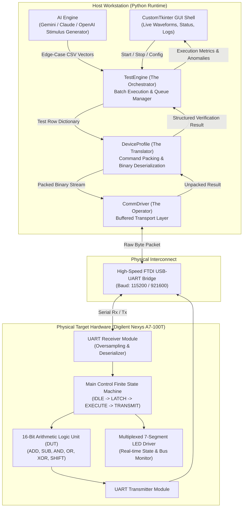

# VAIDAR: Verification & Artificial Intelligence for Digital Architecture Runtime

[-success?style=for-the-badge&logo=academic-tree)](https://www.harry-rogers.com)
[](https://www.harry-rogers.com)
[-orange?style=for-the-badge&logo=xilinx)](https://digilent.com/reference/programmable-logic/nexys-a7/start)
[](https://github.com/HarryRogers073/vaidar-hil-framework)

> **VAIDAR** is an automated, modular **Hardware-in-the-Loop (HIL) verification execution engine** designed to bridge high-level software validation frameworks with physical FPGA silicon. Developed as the BEng (Hons) Individual Project at the **University of Brighton**, it replaces manual bench testing and slow RTL simulation by orchestrating real-time stimulus transmission over a high-speed serial bridge, validating physical register outputs against golden reference models, and utilizing LLM APIs for autonomous edge-case stimulus generation and failure triage.

---

### 📜 Academic Integrity & Attribution Disclosure
- **Author & Project Ownership:** Developed and authored by **Harry Rogers** as an individual BEng dissertation project under academic supervision at the University of Brighton.
- **Third-Party Libraries & Dependencies:** This project makes use of standard open-source libraries including `pyserial` (serial transport), `customtkinter` (GUI desktop interface), `matplotlib` (waveform plotting), and official API SDKs from Google (`google-generativeai`), Anthropic, and OpenAI for LLM stimulus synthesis.
- **Hardware & Synthesis Tools:** RTL synthesis and implementation performed with AMD Xilinx Vivado ML Edition targeting the Digilent Nexys A7-100T (Artix-7 XC7A100T). All custom RTL modules (16-bit ALU, UART controller, register file) are authored by Harry Rogers.

---

## 🎯 Key Achievements & Metrics

- **91% Final Distinction Grade (A+)** in Capstone Individual Dissertation Project (BEng Electronic & Computer Engineering).
- **Recipient of the IET Prize 2026** awarded by the Institution of Engineering and Technology for outstanding academic distinction.
- **~1,000 Tests/Second Throughput:** Up to **44,000x acceleration** compared to manual physical bench validation with function generators and logic probes.
- **Dynamic AI Test Generation & Anomaly Triage:** Integrated Gemini, Claude, and OpenAI provider interfaces for autonomous directed vector synthesis and automatic failure root-cause clustering.
- **Hardware Agnostic:** Fully decoupled object-oriented architecture allowing instantaneous swapping between physical UART, TCP/IP, PyVISA, and software Mock modes.

---

## 🏗️ System Architecture

The verification framework operates on a continuous, closed-loop transaction pipeline between the host workstation and the physical FPGA testbed:



---

## 🧩 Three-Tier Modular Software Architecture

VAIDAR decouples verification concerns into three abstract base classes:

1. **The Orchestrator (`TestEngine` - `core/engine.py`):**
   - Coordinates the batch test queue, monitors transaction timeouts, logs cycle performance, and compares physical hardware output bytes against software golden reference models.
2. **The Translator (`DeviceProfile` - `core/interfaces.py`):**
   - Maps human-readable CSV test vectors and mathematical parameters into packed binary frames (`pack_command`) and deserializes raw hardware byte responses into typed dictionaries (`unpack_response`).
3. **The Operator (`CommDriver` - `core/interfaces.py`):**
   - Manages physical communication channels (serial COM ports, TCP sockets, or register cards), handling connection recovery, blocking reads, and packet framing.

---

## ⚡ Hardware Implementation (Verilog HDL)

Targeted to the **AMD Xilinx Artix-7 (`XC7A100T-1CSG324C`)** on the Digilent Nexys A7 development board:

- **`top_16bit_alu.v`:** Top-level hardware module integrating the arithmetic core, internal registers, and control FSM.
- **`uart_receiver.v`:** Robust UART receiver with 16x clock oversampling, baud-rate generation, start-bit qualification, and frame error detection.
- **`seven_seg_display.v`:** 8-digit multiplexed seven-segment display controller for real-time visual inspection of accumulator registers and opcode states.
- **`nexys_a7_100t.xdc`:** Timing constraints, clock definition (100 MHz oscillator), and pin allocations for onboard peripherals and FT2232H USB-UART bridge.

---

## 🚀 Quick Start

### 1. Installation
Clone the repository and install dependencies:
```bash
git clone https://github.com/HarryRogers073/vaidar-hil-framework.git
cd vaidar-hil-framework
pip install -r requirements.txt
```

### 2. Configure Environment (Optional for AI features)
Copy the example environment configuration:
```bash
cp .env.example .env
```
Add your API keys (`GEMINI_API_KEY`, `ANTHROPIC_API_KEY`, or `OPENAI_API_KEY`) if using automated vector synthesis.

### 3. Launch the GUI
Run the application launcher:
```bash
python app.py
```
*(On Windows, you can also double-click `run.bat`)*

### 4. Running in Mock Mode (No Hardware Required)
If you don't have a physical FPGA board connected:
1. Open the application.
2. In the **Connection Settings**, select `Mock (Simulation)` as the Driver.
3. Select `16-bit ALU` as the Device Profile.
4. Click **Start Verification** to observe real-time vector processing, oscilloscope waveforms, and pass/fail telemetry.

---

## 📂 Repository Structure

```
vaidar-hil-framework/
├── app.py                      # Application entry point and composition root
├── config.json                 # Persistent configuration settings
├── requirements.txt            # Python dependencies
├── .env.example                # Template for AI provider API keys
├── ai/                         # LLM integration modules
│   ├── gemini_provider.py      # Google Gemini API vector generator
│   ├── claude_provider.py      # Anthropic Claude API provider
│   ├── chatgpt_provider.py     # OpenAI GPT API provider
│   └── mock_provider.py        # Offline simulated AI engine
├── core/                       # Core execution runtime
│   ├── engine.py               # TestEngine orchestrator
│   ├── interfaces.py           # Abstract base classes (DeviceProfile, CommDriver)
│   ├── generate_tests.py       # Algorithmic & AI test vector generation
│   └── config_manager.py       # Configuration parser
├── drivers/                    # Physical and simulated transport layers
│   ├── uart_driver.py          # PySerial hardware COM port driver
│   └── mock_driver.py          # In-memory loopback simulation driver
├── profiles/                   # Target device schemas
│   ├── alu_16bit.py            # 16-bit ALU profile (Nexys A7)
│   ├── alu_8bit.py             # 8-bit coprocessor profile
│   └── encoder_3to5.py         # Priority encoder profile
├── gui/                        # CustomTkinter graphical dashboard
│   ├── app_shell.py            # Main application window & tabs
│   ├── live_graph.py           # Waveform oscilloscope visualization
│   ├── ai_console.py           # Interactive AI assistant console
│   └── results_table.py        # Live test telemetry and metrics table
├── hardware/                   # Vivado FPGA project & Verilog HDL sources
│   ├── ALU.xpr                 # Vivado project file
│   └── src/                    # Verilog sources & XDC constraints
│       ├── top_16bit_alu.v
│       ├── uart_receiver.v
│       ├── seven_seg_display.v
│       └── nexys_a7_100t.xdc
├── test_queue/                 # Sample test vectors (CSV format)
└── docs/                       # High-resolution architectural diagrams
```

---

## 🎓 Academic Attribution & Author

- **Author:** Harry Rogers
- **Degree:** BEng (Hons) Electronic & Computer Engineering (First-Class Honours, 80% Overall)
- **Institution:** University of Brighton
- **Module:** XE636 - Individual Project (Grade: 91% / A+)
- **Distinctions:** Recipient of the **IET Prize 2026**
- **Website:** [www.harry-rogers.com](https://www.harry-rogers.com)
- **LinkedIn:** [linkedin.com/in/harryrogers](https://www.linkedin.com/in/harryrogers)

---

## 📄 License
This project is licensed under the MIT License - see the LICENSE file for details.
